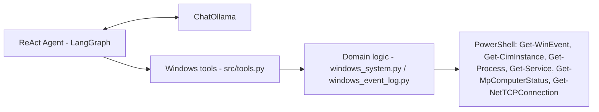

# winscout-ai

A LangChain / LangGraph **ReAct agent** that checks a Windows machine for
system anomalies and gives you a plain-English health summary.

It talks to Windows entirely through PowerShell -- no agent, service, or
extra software needs to run beyond Python, `uv`, and Ollama. Works running
directly on Windows (tested in `cmd`) as well as from a Linux environment
with `powershell.exe` reachable on `PATH`.

## What it checks

The agent has 7 tools and decides for itself which ones to call based on
your question:

| Tool | What it does |
|---|---|
| `get_windows_event_log` | Recent entries from the System / Application / Security event logs, optionally filtered by severity |
| `get_windows_resource_usage` | CPU load, memory usage, uptime |
| `get_windows_disk_usage` | Free/used space per drive letter |
| `get_windows_top_processes` | Top processes by CPU time or working-set memory |
| `get_windows_stopped_services` | Auto-start services that should be running but aren't |
| `get_windows_defender_status` | Windows Defender / real-time protection status |
| `get_windows_outgoing_connections` | Established outbound TCP connections, grouped by process + remote address/port with a connection count |

The agent is instructed to base its summary only on data the tools actually
return (never invented event IDs, process names, or numbers), and to flag
anomalies like high CPU/memory, low disk space, stopped services, disabled
Defender, or a process opening an unusually large number of connections to
one destination.

## Requirements

- `powershell.exe` reachable on `PATH`
- [uv](https://docs.astral.sh/uv/) for dependency management
- [Ollama](https://ollama.com/) running locally with a tool-calling-capable
  model pulled (default `qwen2.5`)

## Setup

1. Clone the repository:
    ```bash
    git clone https://github.com/kumar-albert/winscout-ai.git
    cd winscout-ai
    ```
2. Install dependencies:
    ```bash
    make install
    ```
    On Windows (`cmd`/PowerShell, no `make` required):
    ```bat
    make.bat install
    ```
3. Copy the env template and adjust if needed:
    ```bash
    cp .env.example .env
    ```
4. Pull the model:
    ```bash
    ollama pull qwen2.5
    ```

## Usage

**One-shot health check** -- asks the agent the question in
`DEFAULT_AGENT_QUESTION` (see `.env.example`) and prints its summary:

```bash
make run          # or, on Windows: make.bat run
```

**Interactive chat** -- a REPL that keeps conversation history across turns,
so follow-up questions ("is that high?") work without repeating context.
Type `exit`, `quit`, or `q` to leave:

```bash
make chat          # or, on Windows: make.bat chat
```

To ask a single specific question programmatically, use `run_agent()`
directly:

```python
from src.agent import run_agent

print(run_agent("Is anything wrong with my disk space or Defender status?"))
```

## Configuration

All tunables live in `.env` (see `.env.example` for defaults), loaded via
`src/config.py`:

| Variable | Default | Purpose |
|---|---|---|
| `OLLAMA_MODEL` | `qwen2.5` | Model served by local Ollama |
| `OLLAMA_TEMPERATURE` | `0` | Sampling temperature |
| `OLLAMA_NUM_CTX` | `8192` | Context window given to the model |
| `POWERSHELL_TIMEOUT_SECONDS` | `30` | Timeout per PowerShell call |
| `DEFAULT_EVENT_LOG_MAX` | `20` | Default max events per log query |
| `DEFAULT_TOP_PROCESSES` | `10` | Default process count for the top-processes tool |
| `DEFAULT_OUTGOING_CONNECTIONS_TOP_N` | `15` | Default group count for the connections tool |
| `DEFAULT_AGENT_QUESTION` | see `.env.example` | Question `make run` asks by default |
| `LOG_LEVEL` | `INFO` | Logging verbosity (see below) |

## Logging

Every layer logs through `src/logger.py`. At the default `INFO` level you
get agent lifecycle events (run start/finish, timing) and warnings for real
findings (stopped services, Defender disabled, PowerShell failures) --
nothing about routine tool tracing. Set `LOG_LEVEL=DEBUG` in `.env` to also
see every tool call's arguments, the PowerShell command it ran, timing, and
result size.

## Project layout

```
main.py                    # entry point, calls run_agent()
makefile                    # make targets (install, run, clean, pre-requisites)
make.bat                    # same targets, for native Windows cmd/PowerShell
src/
  agent.py                 # builds the ChatOllama LLM + create_react_agent, system prompt
  tools.py                 # LangChain @tool wrappers (agent-facing surface)
  windows_system.py        # resource/disk/process/service/Defender/connections logic
  windows_event_log.py     # event log fetching logic
  powershell.py            # shared subprocess + .NET date parsing helpers
  config.py                # .env-backed constants
  logger.py                # logging setup
```

## Architecture



## Contributing

Contributions are welcome! Please open an issue or submit a pull request for any enhancements or bug fixes.

## License

MIT.

## Contact

For any inquiries, please reach out to the repository owner, kumar-albert.
